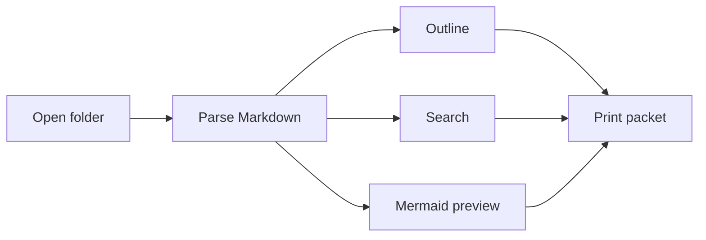

# Mermaid Diagrams

Native Mermaid rendering keeps architecture notes readable without embedding a web view.

```mermaid
flowchart LR
    folder["Open folder"] --> parse["Parse Markdown"]
    parse --> outline["Outline"]
    parse --> search["Search"]
    parse --> diagram["Mermaid preview"]
    outline --> print["Print packet"]
    search --> print
    diagram --> print
```

Open the diagram preview to zoom, pan, detach on macOS, or print it with the document.
