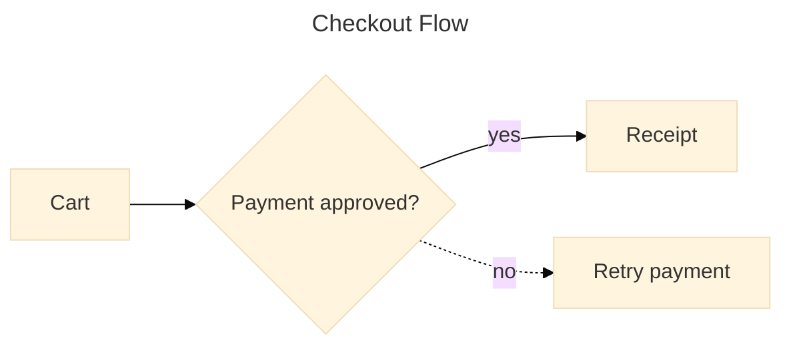

# Mermaid Inline Showcase

This document checks inline native Mermaid rendering.

```mermaid
---
title: Checkout Flow
theme: base
layout: dagre
---
%%{init: {"theme": "base"}}%%
flowchart LR
  accTitle: Checkout Flow
  accDescr: Buyer moves through cart, payment, and receipt.
  Cart[Cart] --> Payment{Payment approved?}
  Payment -->|yes| Receipt[Receipt]
  Payment -.->|no| Retry[Retry payment]
```

The diagram above should be clickable and open a zoomable preview.

